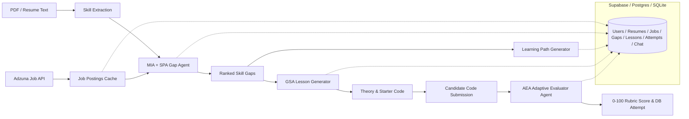

# SkillBridge AI 🚀

**SkillBridge AI** is an AI-powered developer learning platform designed to bridge the gap between candidate resumes/syllabi and live market job postings. It extracts technical skills, identifies concrete gaps, generates focused micro-sprints, and evaluates coding answers using multi-dimensional rubric scoring with complete database persistence.

---

## Key Features

- 🏢 **Live Job Intelligence**: Queries real job postings (via Adzuna) and caches them in PostgreSQL / Supabase with batch tracking.
- 🎯 **AI Agent Skill Delta**: Multi-agent pipeline comparing resume text against job demand to identify top ranked missing skills.
- 🗺️ **Personalized Learning Path**: Generates an ordered study sequence with time estimates and milestones.
- 💻 **Interactive Lesson Workspace**: Delivers theory markdown and broken starter code for immediate practice.
- 📊 **0–100 Rubric Code Evaluation**: Evaluates semantic correctness, code quality, and concept match without executing untrusted code.
- 💬 **Grounded Gap Q&A Chat**: Contextual tutor grounded in skill gap reason, lesson content, and job context.
- 🗄️ **Full Database Persistence**: Automatic session restoration on reload, multi-resume history timeline, and attempt logging.
- 📄 **Downloadable PDF Report**: One-click printable candidate skill coverage and assessment report.
- ⚡ **Hackathon Demo Mode**: Pre-seeded 3-snapshot demo session for offline/reliable live presentations.

---

## Architecture



---

## Tech Stack

| Layer | Technologies |
|---|---|
| **Backend** | Python 3.11+, FastAPI, SQLAlchemy 2.0, Pydantic v2, Uvicorn |
| **Database** | PostgreSQL / Supabase (with automatic SQLite fallback) |
| **AI / Agents** | Google Gemini API (`gemini-2.0-flash`), LangGraph state machine, Groq compatibility |
| **Jobs Data** | Adzuna Jobs API + local sample job fallback |
| **Frontend** | React 18, Vite 6, Custom Teal CSS Design System |

---

## Quick Start

See [RUNNING.md](./RUNNING.md) for full commands and environment configuration.

### Backend:
```powershell
.\.venv\Scripts\Activate.ps1
python -m uvicorn app.main:app --reload --host 127.0.0.1 --port 8000
```

### Frontend:
```powershell
cd frontend
npm run dev -- --host 127.0.0.1 --port 5173
```

### Seed Demo:
```powershell
python scripts/seed_demo.py
```
